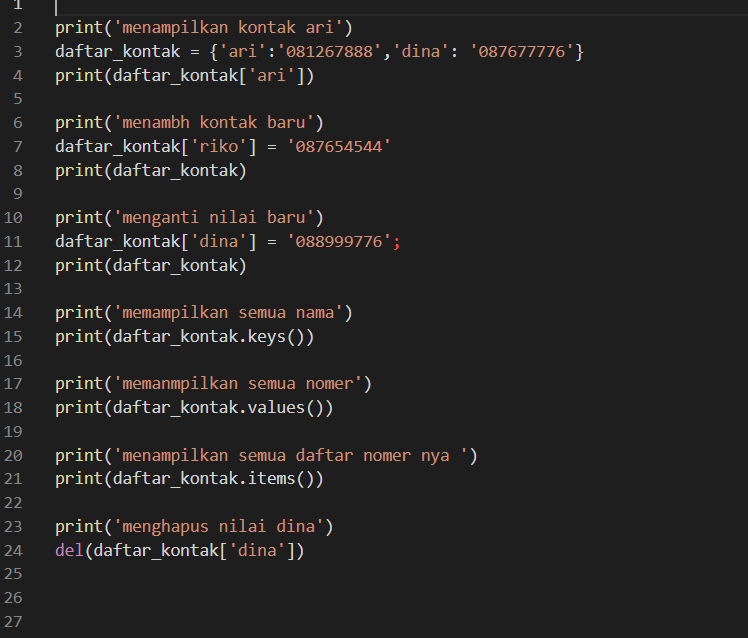
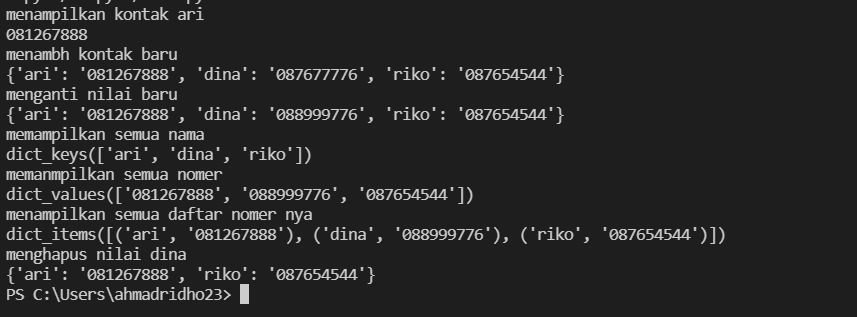
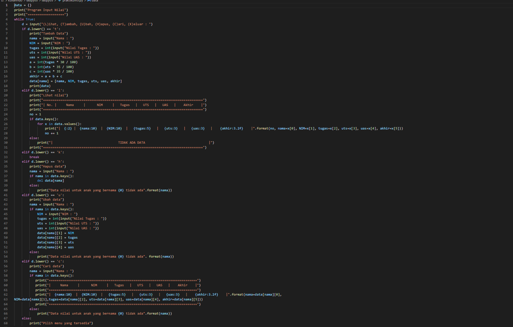
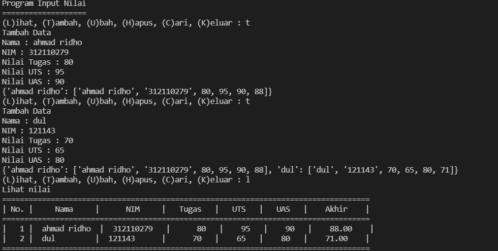
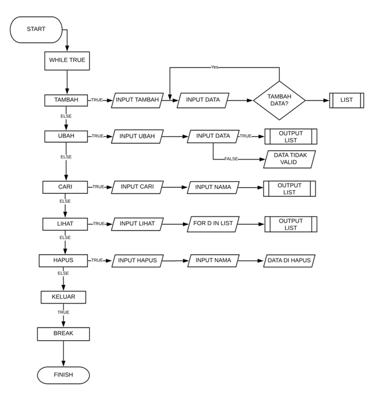

# **labpy05**
# **latihan**  1

## **membuat dictionary daftar kontak**
## dengan nama sebagai key, dan nomer sebagi value 

* __menampilkan kontak ari__
        
        print(daftar_kontak['ari'])
* __menambah kontak baru__
    
        daftar_kontak['riko'] = '087654544'
        print(daftar_kontak)

* __mengganti niali baru__

       daftar_kontak['dina'] = '088999776';
       print(daftar_kontak)

* __menampilkan semua nama__
         
           print(daftar_kontak.keys())

* __menampilkan semua nomer__
  
      print(daftar_kontak.values())

* __menampilkan semua daftar_kontak__
       
        print(daftar_kontak.items())

* __menghapus kontak dina__

      del(daftar_kontak['dina'])

## **Dan berikut output nya**

# **praktikum5**

* Mendeklarasikan dictionary kosongdengan nama dictionary data = {}

* Menginputsalahsatu menu yang tersedia ((L)ihat, (T)ambah, (U)bah, (H)apus, (C )ari, (K)eluar) yang menggunakan perulangan While True

## Untuk menu "Tambah Data" :
      
-     Menggunakan inputan t dan menggunakankondisi if
  
-     Melanjutkanperintah di bawah nya menggunakan inputan  data (Nama, NIM, NilaiTugas, Nilai UTS, Nilai UAS).
-	  Setelahitu, akan mengakses dictionary, nama sebagai key dan nama, NIM, tugas, uts, uas sebagai value.
-	  Lalu  akan mencetak dictionary, setelah data diinput.

## Menu "Lihat Nilai"
   

-     Menggunakaninputan l danmenggunakankondisi elif
-	  Menggunakan kondisi if dan else
-     Untukkondisi if apabilasebelumnyasudahmelakukan input pada menu "Tambah Data" laluakanmencetak data dalambentuk list yang menggunakanperulangan for x in data.values():
-  	  Tetapi, jika sebelumnya tidakmelakukan input data, maka data tidakakandicetakatauditampilkandanakanmencetak TIDAK ADA DATA yang menggunakankondisi else.

## Menu "Keluar"
   
-     Pada menu "Keluar" menggunakaninputan k danfungsipernyataan BREAK, maka program akan berhenti atau keluar
  

## Menu "Hapus Data"
         
-	   Menggunakaninputan h danmenggunakankondisi if dan else
-    	Menginputnama
-   	akanmenghapus data apabila data tersebutsudahdiakses.
-     Dan sebaliknya Untukkondisi if, kode yang digunakan if nama in data.keys(): dan del data[nama] yang, untukkondisi else, maka data tidakberhasil dihapus karena data tidak tersediaa .

  
## menu  "cari data"
-      Menggunakaninputan c danmenggunakankondisi if else
-	   Menginputnama
-	   Apabila data tersebutsudahdiakses, makaakanmencetakdaftarnilaisesuaidengannama yang dicari
-	   Sedangkan, jika data tersebut tidak ada, makatidak akan mencetak daftar nilai

## Kondisi Else
-       menampilkan  inputan yang tidak tersedia

### dan berikut output nya
 

## dan berikut flowchart nya
